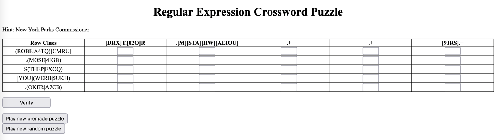

# RegexCrosswordGenerator

This is some relatively simple code to generate 
a Regex Crossword when given the desired solution.

Pre-made solutions are available, alongside the ability
to generate random sequences of letters. 
Clues uniquely matching those sequences are generated by,
for each row, creating an option between two substrings 
of length 2 to 4, using one column clue to specify 
which substring is correct, and specifying other cells
with overlapping ranges.

A Flask web interface is available, but it's an interface 
and not multi-user a webpage because all users access the 
same session of puzzles. Run it by entering in terminal:

```
export FLASK_APP=RegexFlask
export FLASK_ENV=development
flask run
```


# Example


Hint: New York Parks Commissioner

```
---------------------------------------------------------------------------------
|     Row Clues     | [DRX]T.[02O]R | .[M][STA][HW][AEIOU] | .+ | .+ | [9JRS].+ |
---------------------------------------------------------------------------------
| (ROBE|A4TQ)[CMRU] |               |                      |    |    |          |
---------------------------------------------------------------------------------
| .(MOSE|4IGB)      |               |                      |    |    |          |
---------------------------------------------------------------------------------
| S(THEP|FXOQ)      |               |                      |    |    |          |
---------------------------------------------------------------------------------
| [YOU](WERB|5UKH)  |               |                      |    |    |          |
---------------------------------------------------------------------------------
| .(OKER|A7CB)      |               |                      |    |    |          |
---------------------------------------------------------------------------------
```

Solution: `ROBERTMOSESTHEPOWERBROKER`